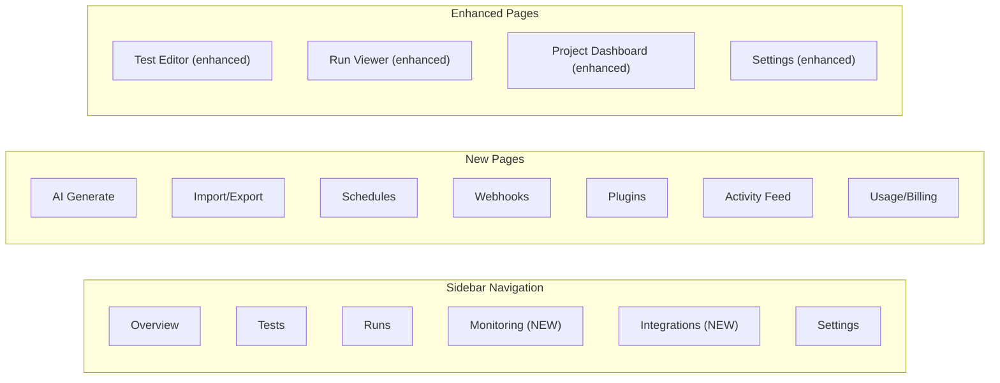

# Frontend UI Build-Out Plan

## Current State

The existing frontend has 9 pages (auth, projects, test editor, run viewer, settings) using:

- Client components with `fetch()` in `useEffect`
- shadcn/ui (17 components installed)
- Glassmorphism + Framer Motion animations
- Sidebar nav with project-scoped sections (Overview, Tests, Runs, Settings)

The backend has 30+ API routes with no corresponding UI.

## Architecture

## Wave 1: Test Editor Enhancements (Highest Impact)

The test editor at `src/app/(dashboard)/projects/[projectId]/tests/[testId]/page.tsx` currently has a step palette with 17 types. It needs:

- **Update step palette** to include the 8 new step types grouped into new categories:
  - Auth: SAVE_AUTH, LOAD_AUTH
  - Mocking: MOCK_ROUTE, REMOVE_MOCK
  - Flow: CONDITIONAL, SKIP_IF
  - Quality: ASSERT_ACCESSIBLE, SECURITY_SCAN
- **New config forms** in `StepConfigForm` for each new step type:
  - MOCK_ROUTE: URL pattern, method dropdown, status code, response body textarea, headers
  - REMOVE_MOCK: URL pattern field
  - CONDITIONAL: Condition type dropdown, condition value, target selector, then/else step references
  - SKIP_IF: Condition type dropdown, condition value, target selector
  - ASSERT_ACCESSIBLE: WCAG level (A/AA/AAA), impact threshold dropdown, fail toggle
  - SECURITY_SCAN: Scan type checkboxes (headers, cookies, csrf, xss, mixed_content)
  - SAVE_AUTH / LOAD_AUTH: Auth state name input
- **Export button** in the test editor header: calls `GET /api/tests/[testId]/export`, downloads `.spec.ts` file
- **Import button**: opens dialog with textarea for pasting Playwright code, calls `POST /api/tests/import`, previews extracted steps, then creates them

## Wave 2: AI Test Generation Page

New page at `/projects/[projectId]/generate`:

- **Description mode**: Textarea for natural language description, "Generate" button, calls `POST /api/tests/generate`
- **URL mode**: URL input, "Analyze & Generate" button (fetches page accessibility tree first via test run, then calls generate with `mode: "from_url"`)
- **Preview panel**: Shows generated test with step list, allows editing before saving
- **Refine loop**: Feedback textarea + "Refine" button, calls generate with `mode: "refine"`
- **Save button**: Creates test via `POST /api/tests` with the generated steps
- Add "AI Generate" button to the test list page header (links to this page)

## Wave 3: Run Viewer Enhancements

Enhance the run viewer at `src/app/(dashboard)/projects/[projectId]/tests/[testId]/runs/[runId]/page.tsx`:

- **Accessibility tab** (new): Fetch `GET /api/runs/[runId]/accessibility`, show:
  - Score badge (0-100 with color: green >80, yellow 50-80, red <50)
  - Violations table: rule ID, impact badge, WCAG criteria, target selector, description
  - Summary cards: critical/serious/moderate/minor counts
- **Performance tab** (new): Fetch `GET /api/runs/[runId]/performance`, show:
  - Core Web Vitals cards (LCP, CLS, FCP, TTFB, INP) with budget indicators
  - Network timing breakdown (DNS, TCP, TLS, Download)
  - Over-budget warnings highlighted in red
- **Security tab** (new): Fetch `GET /api/runs/[runId]/security`, show:
  - Grade badge (A-F with color coding)
  - Findings table: severity badge, type, title, description, remediation
  - Summary cards by severity
- **Correlate button** (on failed runs): Opens dialog, accepts git diff (paste or file upload), calls `POST /api/runs/[runId]/correlate`, shows probable cause with file:line and confidence
- **Assign button** (on failed runs): Opens dialog with team member dropdown + note textarea, calls `POST /api/runs/[runId]/assign`
- **Comments section**: Below the tabs, shows comments for this run, add comment form. Calls `GET/POST /api/projects/[projectId]/comments?targetType=run&targetId=[runId]`

## Wave 4: Monitoring & Scheduling Page

New page at `/projects/[projectId]/monitoring`:

- **Schedules section**:
  - List of schedules with name, cron description, next run, last run, enabled toggle
  - Create schedule dialog: name, cron expression (with preset dropdown: hourly/daily/weekly), test multi-select, environment select, region select
  - Edit/delete actions per schedule
  - Calls `GET/POST/PUT/DELETE /api/projects/[projectId]/schedules`
- **Webhooks section** (same page, tabbed):
  - List of webhooks with name, URL, events, enabled toggle
  - Create webhook dialog: name, URL, events multi-select (run_passed, run_failed, run_error, *), secret, headers
  - Edit/delete actions per webhook
  - Calls `GET/POST/PUT/DELETE /api/projects/[projectId]/webhooks`
- Add "Monitoring" link to the sidebar nav (between Runs and Settings)

## Wave 5: Integrations & Plugins Page

New page at `/projects/[projectId]/integrations`:

- **Installed plugins** list: plugin name, category, enabled toggle, configure button
- **Available plugins** grid: cards showing name, description, author, category, "Install" button
- **Plugin config dialog**: Dynamic form based on `configSchema` from `PluginDefinition`
- Calls `GET/POST /api/plugins`, `GET/POST/PUT/DELETE /api/projects/[projectId]/plugins`
- Add "Integrations" link to the sidebar nav (between Monitoring and Settings)

## Wave 6: Dashboard & Settings Enhancements

**Project dashboard** (`/projects/[projectId]/page.tsx`):

- Add **Performance trends** section: Line chart placeholder showing LCP/CLS over recent runs (data from `GET /api/projects/[projectId]/performance?metric=LCP`)
- Add **Activity feed** section: Recent activity log entries (from `GET /api/projects/[projectId]/activity?limit=10`), showing user, action, entity, timestamp
- Add **Security overview**: Latest security grade badge if any runs have security data

**Project settings** (`/projects/[projectId]/settings/page.tsx`):

- Add **Performance Budgets** tab: LCP, CLS, INP, TTFB inputs with save (calls `PUT /api/projects/[projectId]/performance`)
- Add **WCAG Level** selector (A/AA/AAA)

**User settings** (`/settings/page.tsx`):

- Add **Usage** tab: Current tier, runs this month / limit, tests count, projects count (from `GET /api/usage`)
- Progress bar for run quota

**Sidebar** (`src/components/layout/sidebar.tsx`):

- Add Monitoring and Integrations nav items with appropriate icons

## Files to Modify

- `src/components/layout/sidebar.tsx` — Add Monitoring, Integrations nav items
- `src/app/(dashboard)/projects/[projectId]/tests/[testId]/page.tsx` — New step types in palette, export/import buttons
- `src/app/(dashboard)/projects/[projectId]/tests/[testId]/runs/[runId]/page.tsx` — Accessibility, Performance, Security tabs, comments, assign
- `src/app/(dashboard)/projects/[projectId]/page.tsx` — Activity feed, perf trends, security overview
- `src/app/(dashboard)/projects/[projectId]/settings/page.tsx` — Performance budgets tab
- `src/app/(dashboard)/settings/page.tsx` — Usage tab

## New Pages to Create

- `src/app/(dashboard)/projects/[projectId]/generate/page.tsx` — AI test generation
- `src/app/(dashboard)/projects/[projectId]/monitoring/page.tsx` — Schedules + webhooks
- `src/app/(dashboard)/projects/[projectId]/integrations/page.tsx` — Plugin management

## Conventions

- All pages are `"use client"` with `fetch()` in `useEffect`
- Use existing shadcn/ui components (may need to add `switch`, `checkbox`, `progress` via `npx shadcn@latest add`)
- Follow glassmorphism styling: `bg-card/40 backdrop-blur-xl border-border/40 rounded-2xl`
- Framer Motion animations with staggered delays
- Toast notifications via Sonner for success/error feedback
- Loading states with Skeleton components

